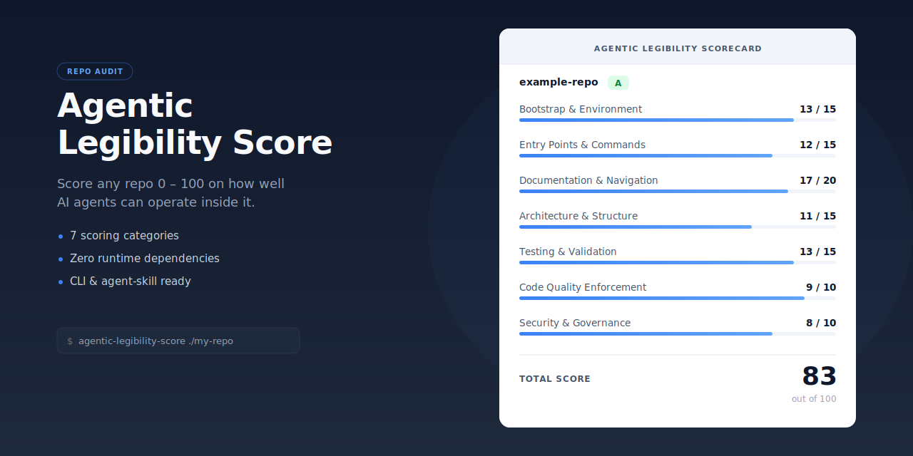

# Agentic Legibility Score

<p align="center">
  
</p>

**Score any code repository 0–100 on how effectively AI agents can autonomously operate within it.**

[](https://github.com/LatencyTDH/agentic-legibility/actions/workflows/ci.yml)
[](LICENSE)
[](https://www.python.org/downloads/)

Agent failures are usually **environment failures**, not model failures. This project grades the scaffolding around a codebase — setup, commands, docs, tests, quality gates, and security — so you can see where agents will stall before you hand them the keys.

## Table of Contents

- [Why this exists](#why-this-exists)
- [30-second quick start](#30-second-quick-start)
- [What you get](#what-you-get)
- [Scoring categories](#scoring-categories)
- [Grade scale](#grade-scale)
- [Sample output](#sample-output)
- [How it works](#how-it-works)
- [Project structure](#project-structure)
- [What the scanner detects](#what-the-scanner-detects)
- [Requirements](#requirements)
- [Sources](#sources)
- [Contributing](#contributing)

## Why this exists

If you give an agent a repo with hidden setup steps, undocumented commands, weak tests, or ambiguous structure, it does not matter how good the model is — it will waste time guessing.

This project gives you a repeatable way to:

- **Audit a repo before letting agents modify it**
- **Find the highest-leverage DX fixes** for agent-assisted development
- **Benchmark progress over time** as you improve documentation and harnesses
- **Compare repos or codebases** using the same seven-category rubric

## 30-second quick start

### 1) Fastest path: install as an AI agent skill

```bash
npx skills add LatencyTDH/agentic-legibility
```

Then ask your agent:

> Score this repo on agentic legibility

The agent runs the scanner, reads the repo for qualitative assessment, and produces a full scorecard.

<details>
<summary>Manual skill install</summary>

Clone or copy the `agentic-legibility/` folder into your agent's skill directory:

| Agent | Skill Directory |
|---|---|
| Claude Code | `~/.claude/skills/` |
| GitHub Copilot | `~/.copilot/skills/` or workspace `.github/skills/` |
| Cursor | Project root or `.cursor/skills/` |

</details>

### 2) Fastest path: run the standalone CLI directly from GitHub

```bash
python3 -m pip install "git+https://github.com/LatencyTDH/agentic-legibility.git"
agentic-legibility-score /path/to/your/repo > legibility.json
```

This installs an executable CLI without needing to clone the repo first.

### 3) Clone and run locally

```bash
git clone https://github.com/LatencyTDH/agentic-legibility.git
cd agentic-legibility
python3 scripts/scan_repo.py /path/to/your/repo
```

Want copy-paste workflows for all three paths? See [docs/quickstart.md](docs/quickstart.md).

## What you get

- A **mechanical scanner** that checks 100+ repo signals across 7 categories
- A **qualitative rubric** for the parts scanners miss
- An **agent skill** that combines both into a readable scorecard
- A **zero-runtime-dependency Python CLI** for fast local audits
- A reusable framework for improving repo readiness for Codex, Claude, Copilot, Cursor, and other coding agents

## Scoring Categories

| # | Category | Max Pts | Core Question |
|---|---|---|---|
| 1 | **Bootstrap & Environment** | 15 | Can an agent set up and run the project cold? |
| 2 | **Entry Points & Commands** | 15 | Can it find build/test/lint without guessing? |
| 3 | **Documentation & Navigation** | 20 | Is there a map? Can the agent find its way? |
| 4 | **Architecture & Structure** | 15 | Does it understand *why* things are where they are? |
| 5 | **Testing & Validation** | 15 | Can it verify changes without a human? |
| 6 | **Code Quality Enforcement** | 10 | Are quality gates automated and discoverable? |
| 7 | **Security & Governance** | 10 | Will it avoid introducing vulnerabilities? |

Scores combine a mechanical scanner with an LLM qualitative pass — the agent reads actual file contents and adjusts where the scanner's hardcoded patterns miss non-standard tooling.

## Grade Scale

| Score | Grade | What Agents Can Do |
|---|---|---|
| 90–100 | **A+** | Full autonomous operation — ship features independently |
| 80–89 | **A** | High autonomy, minimal guidance |
| 70–79 | **B** | Moderate autonomy, needs help on complex tasks |
| 60–69 | **C** | Basic maintenance only |
| 40–59 | **D** | Frequent stalling, constant intervention |
| 20–39 | **F** | Mostly unable to operate |
| 0–19 | **F-** | Effectively opaque to agents |

## Sample Output

```text
╔══════════════════════════════════════════════════════════════════╗
║                  AGENTIC LEGIBILITY SCORECARD                   ║
║                       my-project                                ║
╚══════════════════════════════════════════════════════════════════╝

┌─────────────────────────────────────┬───────┬───────┬──────────┐
│ Category                            │ Score │  Max  │  Grade   │
├─────────────────────────────────────┼───────┼───────┼──────────┤
│ 1. Bootstrap & Environment          │  12   │  15   │  ▓▓▓▓▓░  │
│ 2. Entry Points & Commands          │  10   │  15   │  ▓▓▓▓░░  │
│ 3. Documentation & Navigation       │  14   │  20   │  ▓▓▓▓░░  │
│ 4. Architecture & Structure         │   8   │  15   │  ▓▓▓░░░  │
│ 5. Testing & Validation             │  13   │  15   │  ▓▓▓▓▓░  │
│ 6. Code Quality Enforcement         │   9   │  10   │  ▓▓▓▓▓░  │
│ 7. Security & Governance            │   6   │  10   │  ▓▓▓▓░░  │
╞═════════════════════════════════════╪═══════╪═══════╪══════════╡
│ TOTAL                               │  72   │  100  │    B     │
└─────────────────────────────────────┴───────┴───────┴──────────┘

GRADE: B  —  "Solid foundation, but agents still need a guide for complex tasks"
```

## How It Works

1. **Scanner** (`agentic_legibility_score.py`) — Walks the repo tree and checks 100+ mechanical signals: file existence, config parsing, CI detection, documentation quality metrics, cross-linking, and common build-tool conventions across major ecosystems.
2. **Rubric** (`references/scoring-rubric.md`) — Detailed point breakdowns for each category and sub-criterion with full/partial/zero credit definitions.
3. **Skill** (`SKILL.md`) — Two-pass workflow: run the scanner for a mechanical baseline, then read the actual repo to adjust scores where hardcoded patterns miss non-standard tooling. Produces a formatted scorecard with per-category deep-dives.
4. **Verification harness** (`tests/` + `.github/workflows/ci.yml`) — Confirms the installable CLI, standalone wrapper, and core detection paths keep working.

## Project Structure

```text
agentic-legibility/
├── agentic_legibility_score.py      # Installable Python module and CLI entry point
├── SKILL.md                         # Agent skill instructions (two-pass workflow)
├── scripts/
│   └── scan_repo.py                 # Standalone wrapper for the scanner CLI
├── docs/
│   ├── quickstart.md                # Copy-paste install and usage paths
│   └── assets/hero.svg              # Repo hero / social-preview source asset
├── tests/
│   └── test_scan_repo.py            # Regression tests for packaging and detection
├── .github/
│   ├── workflows/ci.yml             # CI: lint + test + build validation
│   └── dependabot.yml               # Dependency update automation
├── references/
│   └── scoring-rubric.md            # Detailed scoring criteria & rubric
├── AGENTS.md                        # Agent guide for this repo (dogfooding!)
├── CONTRIBUTING.md                  # How to contribute
├── CHANGELOG.md                     # Version history
├── SECURITY.md                      # Vulnerability reporting policy
├── LICENSE                          # MIT
└── README.md                        # You are here
```

## What the Scanner Detects

- **Package manifests** — package.json, pyproject.toml, Cargo.toml, go.mod, solution and project files, and 10+ more
- **Build/test/lint commands** — package scripts, Makefile targets, task runners, build-tool conventions, CI steps
- **Documentation** — README quality, AGENTS.md, CONTRIBUTING, docs/ structure, cross-linking
- **Architecture** — ADRs, design docs, exec plans, quality scores, code organization
- **Testing** — Test directories, test files, framework-specific project patterns, CI pipelines, coverage config, E2E setup
- **Code quality** — 15+ linter/formatter configs, analyzer signals, type checking, pre-commit hooks
- **Security** — .gitignore coverage, Dependabot/Renovate, CODEOWNERS, security policies

## Requirements

- **Python 3.9+**
- Runtime uses the **standard library only**
- Maintainer validation uses lightweight dev tools (`ruff`, `build`) documented in [CONTRIBUTING.md](CONTRIBUTING.md)

## Sources

Built on frameworks from:

- [Agent Legibility Scoring](https://seand.ai/blog/agent-legibility-scoring/) — seand.ai (2026)
- [Harness Engineering](https://openai.com/index/harness-engineering/) — OpenAI (2025)

## Contributing

See [CONTRIBUTING.md](CONTRIBUTING.md) for guidelines.

## License

[MIT](LICENSE)
